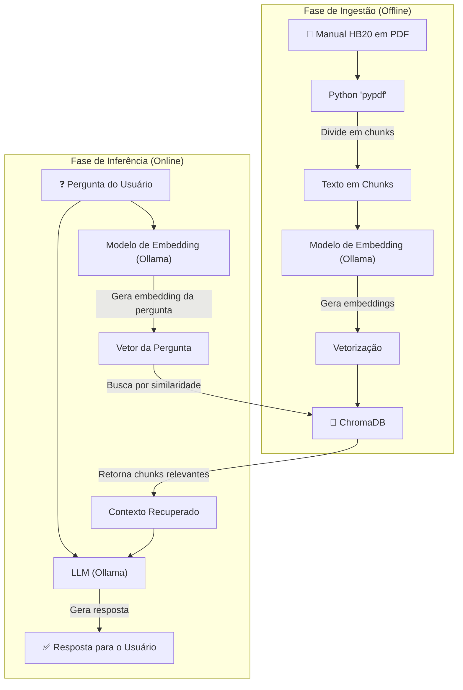

# 🚗 Chat com Manual - Hyundai HB20 (RAG com Ollama)


> Um assistente de chatbot que responde perguntas sobre o Hyundai HB20, utilizando o manual do proprietário como base de conhecimento através de uma arquitetura RAG.

Este projeto é uma demonstração prática de **Retrieval-Augmented Generation (RAG)**. Ele transforma um documento denso e complexo — o manual do proprietário do Hyundai HB20 — em uma base de conhecimento acessível, permitindo que usuários façam perguntas em linguagem natural e recebam respostas precisas e contextuais.

## 🎯 O Problema

Manuais de veículos são extensos, técnicos e, na maioria das vezes, difíceis de consultar. Encontrar uma informação específica, como a pressão correta dos pneus ou os passos para trocar uma lâmpada, pode ser uma tarefa manual e demorada. Como resultado, muitos proprietários não aproveitam as informações vitais fornecidas pelo fabricante.

## ✨ A Solução

Este chatbot resolve o problema ao:
1.  **Processar** o manual em PDF do HB20.
2.  **Dividir** o conteúdo em trechos de informação (`chunks`).
3.  **Vetorizar** esses trechos usando um modelo de embedding e armazená-los em um banco de dados vetorial (ChromaDB).
4.  **Permitir** que o usuário faça uma pergunta, que também é vetorizada.
5.  **Recuperar** os trechos mais relevantes do manual e, junto com a pergunta, **gerar** uma resposta coesa e precisa usando um Large Language Model (LLM) através do Ollama.

##  diagrama da Arquitetura

O fluxo de dados do sistema pode ser visualizado da seguinte forma:



## 🛠️ Tecnologias Utilizadas

* **LLM e Embeddings:** [Ollama](https://ollama.com/)
* **Banco de Dados Vetorial:** [ChromaDB](https://www.trychroma.com/)
* **Linguagem:** Python
* **Bibliotecas Principais:** `ollama`, `chromadb`, `pypdf`

## 🚀 Começando

Siga os passos abaixo para executar o projeto localmente.

### Pré-requisitos

* [Python 3.10+](https://www.python.org/) instalado.
* [Ollama](https://ollama.com/download) instalado e em execução na sua máquina.
* [Git](https://git-scm.com/) para clonar o repositório.

### Instalação e Execução

1.  **Clone o repositório:**
    ```bash
    git clone [https://github.com/alexbispo/Ollama_rag.git](https://github.com/alexbispo/Ollama_rag.git)
    cd Ollama_rag
    ```

2.  **Crie um ambiente virtual e instale as dependências:**
    ```bash
    python -m venv venv
    source venv/bin/activate  # No Windows, use `venv\Scripts\activate`
    pip install -r requirements.txt
    ```

3.  **Baixe os modelos necessários do Ollama:**
    ```bash
    ollama pull granite3.3:2b
    ollama pull granite-embedding:278m
    ```
    *(Nota: Estes são modelos sugeridos. Você pode usar outros, ajustando os nomes nos scripts.)*

## 💬 Como Usar

Após iniciar a aplicação, basta digitar suas perguntas no terminal.

**Exemplos de perguntas:**

* "Qual a pressão recomendada para os pneus dianteiros e traseiros?"
* "De quantos em quantos quilômetros devo fazer a troca do óleo do motor?"
* "Como faço para parear meu celular com o bluetooth do carro?"
* "O que significa a luz de advertência do ABS acesa no painel?"

## 🗺️ Roteiro de Evolução

Este projeto é uma base que pode ser expandida de várias maneiras:

-   [ ] **Interface Gráfica:** Criar uma interface web com Streamlit ou Gradio.
-   [ ] **Avaliação Formal:** Implementar um conjunto de testes (perguntas/respostas) para avaliar a precisão do RAG.
-   [ ] **Melhorar o Chunking:** Experimentar estratégias de divisão de texto mais avançadas.
-   [ ] **Expandir Conhecimento:** Adicionar mais documentos, como reviews ou guias de manutenção.
-   [ ] **Streaming de Respostas:** Fazer com que o LLM retorne a resposta em tempo real, token a token.

Criado com 🧠 por **Alex Bispo**.
